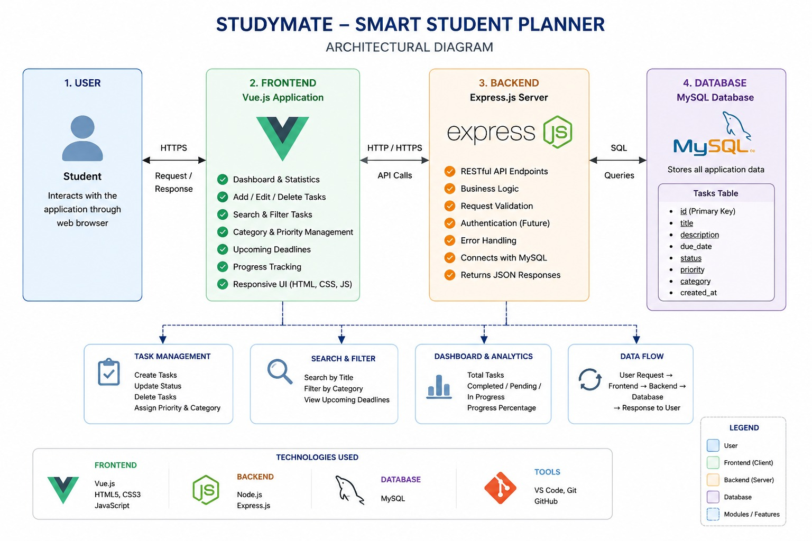

# 📚 StudyMate – Smart Student Planner

## Problem Statement

University students often struggle to manage assignments, laboratory work, project deadlines, and examination schedules. As academic workloads increase, students may forget important deadlines, fail to prioritize tasks effectively, and experience poor time management.

A centralized task management platform can help students organize their academic responsibilities, improve productivity, and reduce missed deadlines.

## Solution Overview

StudyMate is a web-based student planner designed to help university students organize and manage their academic tasks efficiently.

The system allows students to create tasks, assign priorities, categorize academic activities, monitor progress, track upcoming deadlines, and update task completion status through an intuitive dashboard interface.

By providing task organization and deadline management features, StudyMate helps students improve productivity and academic planning.

## Technologies Used

### Frontend

* Vue.js
* HTML5
* CSS3
* JavaScript

### Backend

* Node.js
* Express.js

### Database

* MySQL

### Deployment & Hosting
* Vercel (Frontend Hosting)
* Railway (Backend & Database Hosting)

### Development Tools

* Visual Studio Code
* Git
* GitHub

### Evidence of Technology Usage

* Vue.js used for reactive user interface development.
* Express.js used to create REST API endpoints.
* MySQL used for task data storage and retrieval.
* Railway used to deploy the backend server and MySQL database.
* Vercel used to deploy the frontend application.
* GitHub used for version control and project management.

## Architectural Diagram

## Key Features

- Create new tasks
- Delete existing tasks
- Update task status
- Search tasks
- Categorize tasks
- Assign task priorities
- Smart priority suggestion
- Upcoming deadline tracking
- Progress tracking dashboard
- Responsive user interface

## Deployment URL

Frontend URL:
https://study-mate-orpin.vercel.app/

Backend API:
https://studymate-production-f6e1.up.railway.app

API Test:
https://studymate-production-f6e1.up.railway.app/tasks

## Author

Rathanayke M.S.S.
Computer Engineering
Faculty of Engineering
University of Ruhuna.